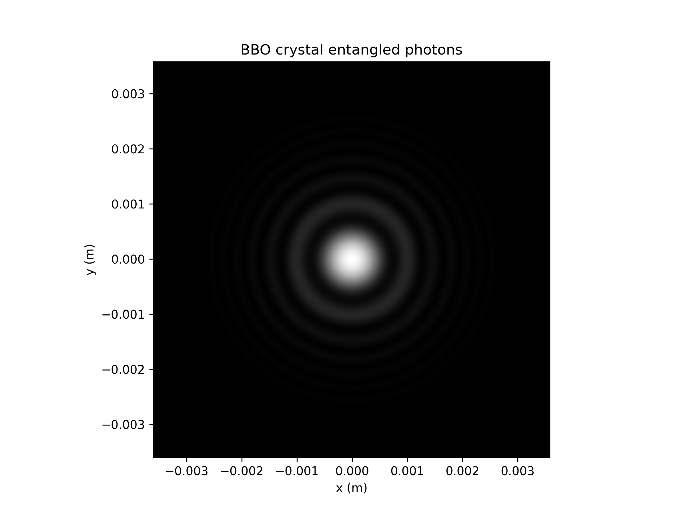

# spdc-simulator
## Simulate entangled photon pair generation from a BBO bulk crystal
### Introduction
Spontaneous parametric down-conversion is a process in which one higher energy photon is converted into two
lower energy photons which can be entangled in momentum (k-vector) and polarization. Bulk crystals such as
beta-barium borate (BBO) which have $chi^{(2)}$ nonlinearities are often used as relatively low cost platforms for spontaneous parametric down-conversion. BBO crystals can be used to facilitate both type I and type II SPDC processes. For a type I process, the two 
entangled and down-converted photons (referred to as "signal" and "idler") share the same polarization. For a type II process,
the signal and idler photon will have opposite polarizations. 


This repo contains functions which can help with visualizing type I and type II SPDC via a BBO crystal. All 
phase-matching expressions, pump beam expressions, coincidence count rate expressions, and Sellmeier equations for the BBO crystal are taken from 
"Phase matching in β-barium borate crystals for spontaneous parametric down-conversion" (Suman Karan et al 2020 J. Opt. 22 083501) so please check out that paper for detailed derivations for expressions. The purpose of this code is to reproduce the results of that paper for visualization purposes, allow for playing around with parameters and for additional exploration.

### Code description
- `file_utils.py`: Utility functions for creating directories and saving data.
- `run_momentum_sims.py`: Run simulations to visualize the SPDC photons in momentum-space. 
- `run_sims_phase_matching.py`: Run simulations to visualize SPDC phase-matching functions.
- `run_sims_power_angle.py`: Run simulations to plot power output with tilt angle. (Reproduce figure 10 of J. Opt. 22 (2020) 083501)
- `run_sims_typeI.py`: Run simulations to plot photon intensity from type I phase-matched SPDC for three different tilt angles. (Reproduce figure 8 of J. Opt. 22 (2020) 083501). This script requires significant RAM to run: I used a GCP instance with 112 cores and 224 GB RAM. 
- `run_sims_typeII.py`: Run simulations to plot photon intensity from type II phase-matched SPDC for three different tilt angles. (Reproduce figure 9 of J. Opt. 22 (2020) 083501). This script requires significant RAM to run: I used a GCP instance with 112 cores and 224 GB RAM. 
- `simulate_spdc.py`: Contains functions for simulating photon intensity, phase-matching, and total output power for SPDC photons.

### Example results
`run_sims_typeI.py` reproduces figure 8 from J. Opt. 22 (2020) 083501. My results:
<table>
  <tr>
    <td style="text-align:center;">
      <br>
      <b>\(\theta = 28.64 \deg\)</b>
    </td>
    <td style="text-align:center;">
      <br>
      $\theta = 28.74 \deg$
    </td>
    <td style="text-align:center;">
      <br>
      <b>$\theta = 28.95 \deg$</b>
    </td>
  </tr>
</table>

`run_sims_typeII.py` reproduces figure 9 from J. Opt. 22 (2020) 083501. My results:


### How to install and run
All files other than `run_sims_typeI.py` and `run_sims_typeII.py` can be run on a laptop. 

To run `run_sims_typeI.py` and `run_sims_typeII.py`, I used a GCP instance with 112 cores and 224 GB RAM. To check memory usage while running the code, it is helpful to add `from memory_profiler import profile` and use the `@profile` decorator, and to use `import psutil` and
`print(psutil.virtual_memory())`.

Step by step instructions for running from a GCP instance:
1. Install pip, numpy, other dependencies.

```
sudo apt update
sudo apt install python3-venv python3-pip
```

2. Create a venv.
```
 python3 -m venv myvenv
```

3. Install necessary packages.
```
pip3 install numpy matplotlib scipy joblib psutil memory_profiler
sudo apt-get install tmux
```

4. Start a tmux session and run the scripts. 
```
tmux
source myvenv/bin/activate
python [script_name].py
```

### Additional plots

